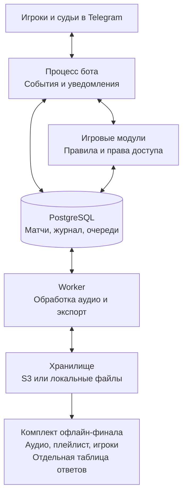

# Музыкальный турнир

**Архитектура бота и подготовка офлайн финала**

Спецификация решения от 7 октября 2026 года. Перенесена в Markdown 8 октября 2026 года.

Статус: архитектура и предлагаемый регламент; реализация бота пока отсутствует.

**Рекомендуемое решение: Telegram-бот с судейскими кнопками, PostgreSQL и отдельным процессом обработки аудио. Бот проводит отборочные матчи, формирует список финалистов и собирает готовый комплект для финала. Финал проводится ведущим без участия бота.**

## Границы системы

В отборочном матче два игрока и выбранный ими судья находятся вместе. Музыку слышат только эти трое. Судья включает трек на одном устройстве, слушает устные ответы и отмечает исполнителя и название независимо. Бот не распознаёт речь и не определяет, кто ответил раньше.

После завершения отбора организатор скачивает список финалистов, обезличенные аудиофайлы, плейлист и отдельную таблицу ответов. Интернет во время финала не нужен. Финальные баллы и победителя ведущий фиксирует самостоятельно; в первой версии нет судейского интерфейса финала.

## Основные решения

- Один код и один активный экземпляр бота для Yandex Cloud и локального компьютера. Получение событий через long polling; публичный домен и открытые входящие порты для базового решения не нужны.

- Повтор песни допустим между независимыми парами. Конкретному игроку не выдаются свои песни и песни, с которыми он уже познакомился через игру или судейство.

- Основной и финальный пулы разделяются до жеребьёвки. Песни финального пула не выдаются в отборе ни при каких обстоятельствах.

- При экспорте из общего финального набора исключаются все песни, присланные любым финалистом. Это обеспечивает запрет собственных треков при любом офлайн формате финала.

- Победа определяется после фиксации результата целого трека. Порядок нажатия кнопок исполнителя и названия не влияет на результат.

Числовые параметры ниже — рекомендуемые настройки первого турнира, которые можно изменить до его запуска. Расчётная нагрузка: 16–64 игрока и до 8 одновременных матчей; это проектная цель, которую нужно проверить перед эксплуатацией.

## Содержание

- [1 Правила первого турнира](#1-правила-первого-турнира)
- [2 Путь организатора и участника](#2-путь-организатора-и-участника)
- [3 Назначение судьи и проведение матча](#3-назначение-судьи-и-проведение-матча)
- [4 Сетка и завершение отбора](#4-сетка-и-завершение-отбора)
- [5 Пулы песен и честная выдача](#5-пулы-песен-и-честная-выдача)
- [6 Финальный набор без собственных песен](#6-финальный-набор-без-собственных-песен)
- [7 Обработка аудио](#7-обработка-аудио)
- [8 Компоненты приложения](#8-компоненты-приложения)
- [9 Данные и защита результатов](#9-данные-и-защита-результатов)
- [10 Запуск в Yandex Cloud и локально](#10-запуск-в-yandex-cloud-и-локально)
- [11 Восстановление безопасность и статистика](#11-восстановление-безопасность-и-статистика)
- [12 План реализации и проверка готовности](#12-план-реализации-и-проверка-готовности)
- [13 Технические источники](#13-технические-источники)

## 1 Правила первого турнира

| **Параметр** | **Рекомендуемое значение** |
| --- | --- |
| Число финалистов | 8 из исходной механики; настраивается до жеребьёвки |
| Заявка участника | 6 песен в основной пул и 4 в финальный |
| Баллы | Исполнитель 0,9; название 1,2; максимум 2,1 за трек |
| Победа в отборочном матче | 9,0 балла после закрытия трека при преимуществе в счёте |
| Ограничение матча | 20 обычных треков; при равенстве до 5 дополнительных |
| Игровой фрагмент | До 60 секунд; один и тот же фрагмент при всех выдачах этой версии |
| Пакет финала | 60 игровых треков и 20 запасных как стартовая настройка |
| Фиксация результата | Подтверждение судьи, затем обоих игроков |
| Время | Хранение в UTC; показывать Asia/Tbilisi |

Если после 20 треков никто не дошёл до 9,0, выигрывает игрок с большим счётом. При равенстве начинается дополнительная серия: после каждого полностью закрытого трека сравнивается общий счёт. Первый неравный итог завершает матч. Если за 5 треков равенство сохраняется, матч приостанавливается; организатор назначает продолжение с новым запасом того же пула. Жребий и техническая победа за плохое угадывание не применяются.

Оба компонента трека разыгрываются до конца независимо. Например, при счёте 8,4 : 8,1 первый игрок берёт исполнителя, второй — название. Итог 9,3 : 9,3 означает продолжение, даже если первая судейская кнопка на мгновение показала 9,3 : 8,1.

### Что считать правильным ответом

При загрузке фиксируются основной исполнитель, название и допустимые варианты: транслитерация, сокращения, альтернативное написание, правила для featuring и каверов. Судья применяет эти варианты, при споре ставит паузу. Если невозможно определить, кто ответил первым, этот компонент остаётся без очков; другой компонент можно продолжать разыгрывать. Ошибка ответа сама по себе очков не отнимает.

Комбинированные кнопки «оба ответа игроку» в первой версии не нужны: четыре кнопки проще проверять и исправлять. Лимиты, стоимость компонентов, правила ответов и повторов сохраняются как неизменяемая версия регламента турнира.

## 2 Путь организатора и участника

### До открытия регистрации

Организатор создаёт турнир, задаёт число финалистов, дедлайны и регламент, назначает человека для проверки музыкальной библиотеки. Проверяющий финальную библиотеку не должен участвовать в финале. Организатор может играть, если управление расписанием отделено от доступа к ответам и финальному экспорту.

### Регистрация и сдача песен

Игрок открывает ссылку приглашения, нажимает Start, выбирает отображаемое имя и принимает правила. Бот выдаёт уникальный номер внутри турнира. Telegram user_id служит постоянным идентификатором; username используется только для отображения и поиска среди уже зарегистрированных пользователей.

Бот показывает два счётчика: «Отбор 0 из 6» и «Финал 0 из 4». Игрок выбирает пул и отправляет готовый файл как Telegram-аудио или документ. MP3 и M4A принимаются до 20 МБ; фактический формат проверяется независимо от расширения. Ограничение связано с getFile облачного Telegram Bot API [1].

Участники сами подготавливают файлы с помощью указанного [@Music_to_you_bot](https://t.me/Music_to_you_bot) или другого удобного источника. Турнирный бот не интегрируется с ним и не скачивает музыку по ссылкам. Пересланный аудиофайл тоже допустим: исходное сообщение остаётся в закрытой заявке, а для игры создаётся и отправляется отдельная обезличенная копия.

После каждого файла бот предлагает проверить исполнителя и название, добавить допустимые ответы. Затем файл проходит обработку и проверку дублей. Статусы понятны игроку: «Обрабатывается», «Нужна правка», «Принят». Квота заполняется только принятыми уникальными песнями. До закрытия сбора заявку можно заменить; история авторства и знакомства с песней сохраняется.

### Закрытие сбора

Организатор получает список неподтверждённых игроков, ошибок файлов, дублей, нехватки песен и риска исчерпания пулов. Жеребьёвка доступна после фиксации состава, завершения обработки и проверки запаса. Игрок без нужного числа принятых треков не попадает в сетку без явного решения организатора.

Пулы замораживаются до жеребьёвки. Нельзя после просмотра сетки перенести удобную песню между пулами. Пополнение возможно только отдельной проверенной партией из того же пула, с причиной и записью в журнале; оно не меняет уже выданные фрагменты и решения.

### Пары и расписание

Каждому игроку приходит карточка соперника, номер матча, срок проведения и кнопка выбора судьи. Пара самостоятельно договаривается о месте и времени. В боте достаточно указать время и короткую заметку; отдельный календарный сервис не нужен. Напоминания идут только участникам конкретного матча.

Публичная сетка содержит имена или номера, завершённые результаты и ожидаемые пары. Названия песен, ответы и состав финального пула в неё не попадают.

## 3 Назначение судьи и проведение матча

Один игрок вводит @username судьи. Если человек уже запускал бота, система предлагает его карточку. В остальных случаях выдаётся персональная ссылка приглашения в матч: судья сам открывает её и нажимает Start. По произвольному @username нельзя надёжно найти личный Telegram-аккаунт через getChat [1].

Судья принимает приглашение, оба игрока подтверждают именно этого человека. Приглашение ограничено сроком действия и одним матчем; знание ссылки само по себе не даёт судейских прав. Судья не может быть одним из двух игроков и одновременно вести два матча. Им может быть участник другого матча: все полученные им песни учитываются как уже известные.

### Перед стартом

Судья видит имена, регламент, порог победы и кнопку «Все на месте». Игроки подтверждают готовность. Бот проверяет доступный запас песен и выдаёт только один текущий трек. Судья получает обезличенное аудио и отдельное сообщение с ответами; свой экран игрокам не показывает.

Судья нажимает «Начать трек» и включает аудио. Эта кнопка фиксирует заявленное начало; Telegram-бот не получает достоверного события фактического запуска встроенного плеера. Таймер судьи служит подсказкой, время до ответа не считается точной спортивной метрикой. По истечении минуты бот напоминает закрыть трек, но не начисляет и не снимает очки автоматически.

### Судейская панель

| **Игрок 7** | **Игрок 18** |
| --- | --- |
| Исполнитель +0,9 | Исполнитель +0,9 |
| Название +1,2 | Название +1,2 |
| Общее действие | Отменить последнее действие |
| Общее действие | Закрыть трек / Никто не угадал |
| Общее действие | Пауза / Ошибка аудио / Спор |

После присуждения исполнителя этот компонент блокируется для второго игрока; название остаётся доступным. Нажатия сохраняются сразу как черновой результат. «Закрыть трек» фиксирует оба компонента одной операцией, оставляя неугаданный компонент без очков. «Никто не угадал» доступно только при двух пустых компонентах. Следующий трек выдаётся отдельным нажатием, чтобы исключить случайный запуск.

В пределах текущего трека судья может отменить действие. Исправление закрытого трека после начала следующего требует паузы и решения организатора с причиной. Финальный счёт подтверждают оба игрока. Спор блокирует продвижение по соответствующей ветке. Если подтверждение не пришло за 10 минут, бот напоминает и передаёт вопрос организатору, но не объявляет автоматическую победу.

## 4 Сетка и завершение отбора

Используется сетка на выбывание с зафиксированной случайной жеребьёвкой. Размер полной сетки B равен ближайшей степени двойки не меньше N. Пустые места дают B − N проходов без игры. Они распределяются по первому кругу без пар из двух пустых мест. Порядок игроков, алгоритм и seed жеребьёвки сохраняются; после публикации сетка не перемешивается.

| **Игроков** | **Первый круг** | **Дальше до восьмёрки** | **Матчей отбора** |
| --- | --- | --- | --- |
| 16 | 8 матчей | Сразу 8 финалистов | 8 |
| 19 | 3 матча и 13 проходов | Ещё 8 матчей | 11 |
| 24 | 8 матчей и 8 проходов | Ещё 8 матчей | 16 |
| 32 | 16 матчей | Ещё 8 матчей | 24 |

При отсутствии снятий и иных исключений до K финалистов требуется N − K сыгранных матчей. Проход без игры не создаёт проигрываний, баллов и статистики угадывания.

Следующий матч можно открыть, когда оба его входящих результата окончательно подтверждены. Не нужно ждать весь круг, если пара уже определилась. При этом финальный экспорт открывается только когда заполнены все K финальных мест и закрыты все отборочные матчи и споры. Текущее число «активных» пользователей не является критерием завершения отбора.

### Нестандартные ситуации

- Если N не больше целевого числа финалистов, отбор не нужен: все подтверждённые игроки попадают в финал. Финальная библиотека должна состоять из песен, неизвестных этим игрокам по заявкам и доступам; обычно нужен запас организатора.

- Снятие до заморозки состава исключает игрока из жеребьёвки. Снятие после публикации оформляется техническим результатом; сетка не пересоздаётся. Технический результат не имитирует сыгранный матч и не добавляет статистику песен.

- Неявку подтверждает организатор после установленного срока. Решение хранит автора, время и причину. Если выбывают оба, ветка останавливается до решения организатора; бот не выбирает случайного победителя.

- Пересмотр результата при ещё не начавшемся следующем матче обновляет назначение. Если потомки уже игрались, изменения не распространяются молча: зависимая ветка блокируется и организатор решает вопрос переигровки.

### Состояния турнира

Черновик → Регистрация → Проверка и заморозка → Отбор → Финалисты определены → Пакет финала готов → Архив. Пауза возможна между рабочими состояниями. Статус «Пакет готов» не означает, что офлайн финал сыгран: организатор архивирует турнир после мероприятия вручную.

## 5 Пулы песен и честная выдача

У песни есть музыкальная идентичность и конкретная запись. Перезалив, другой битрейт или имя файла не превращают её в новую песню. Для защиты ответов каверы, ремиксы и варианты одной композиции по умолчанию относятся к общей группе исключения. Совпадения проверяются по нормализованным названиям, хешу файла и аудиоотпечатку с ручным разбором неоднозначных случаев. Аудиоотпечаток сам по себе не гарантирует поиск всех каверов.

Одна группа не может одновременно находиться в основном и финальном пуле этого турнира. Если одинаковую песню прислали несколько людей, все считаются знающими её. Замена или отклонение дублирующей заявки не удаляет этот факт. Это предотвращает обход запрета собственных треков.

### Алгоритм выдачи в отборе

Сначала берутся только принятые треки основного пула. Удаляются песни, уже выдававшиеся в этом матче, присланные любым из двух игроков или известные одному из них по прошлым играм, судейству и разрешённому просмотру ответов. После фильтрации выбирается случайная песня среди наименее использованных подходящих.

Для распределения учитываются состоявшиеся старты и текущие резервы выдачи. На время выбора блокируется строка пула турнира: система перечитывает счётчики, выбирает песню и создаёт резерв в одной транзакции. Параллельные матчи видят обновлённый запас. Сложность песни и процент угадываний не участвуют ни в фильтре, ни в весах. Повтор между разными парами допустим, если никто из их игроков не знакомился с песней через систему.

Судья считается познакомившимся с песней уже при выдаче аудио или ответа, даже если воспроизведение отменили. Оба игрока — при старте трека. При неоднозначном сбое после возможного воспроизведения знакомство фиксируется консервативно. Система не может определить, что человек слышал вне зарегистрированных матчей; регламент требует не присутствовать на чужих играх и сообщать о таком случае.

### Контроль достаточности

Для матча до старта проверяются минимум 25 подходящих песен: 20 обычных и 5 на равенство. Это защищает от исчерпания при текущих ограничениях; технически забракованные песни могут потребовать дополнительного запаса. До турнира выполняется проверка запаса по возможным путям сетки и симуляция выдач. Повторное судейство активных игроков увеличивает число исключений, поэтому лучше привлекать выбывших и гостей.

При нехватке песен матч не начинает или приостанавливает выдачу. Организатор добавляет проверенный резерв основного пула. Собственные песни, уже известные треки и финальный пул не становятся допустимыми автоматически. Для небольшого турнира разумно подготовить 30–50 дополнительных основных песен; точный запас определяется проверкой, а не только числом файлов в бакете.

## 6 Финальный набор без собственных песен

**Финал проходит без бота. Поэтому экспорт должен обеспечить честность заранее, а не рассчитывать на будущую проверку кнопкой. В общий игровой пакет включаются только песни финального пула, не выдававшиеся в отборе и не знакомые ни одному финалисту по заявкам, судейству или просмотру ответов.**

Это правило сильнее запрета собственной песни в персональном раунде: песни всех финалистов полностью исключаются из общего игрового пакета. Оно подходит для общих вопросов, парных матчей и других офлайн форматов. Исключённые песни остаются в служебном отчёте с причинами, но не лежат рядом с игровыми аудиофайлами.

### Размер библиотеки

Начальная настройка экспорта — 60 основных и 20 резервных треков. Это размер банка для ведущего, а не утверждение о продолжительности финала. Организатор может изменить число до экспорта под программу вечера. При дефиците бот показывает точную нехватку и не подмешивает запрещённые песни.

Если каждый сдаёт 4 финальных трека, при 32 участниках и 8 финалистах останется до (32 − 8) × 4 = 96 подходящих песен; при 16 участниках — до 32, поэтому для пакета из 80 потребуется минимум 48 дополнительных песен организатора. Дубли, ошибки и дополнительные знакомства могут уменьшить эти количества.

До начала турнира проверяется консервативная граница: размер принятого финального пула минус наибольшее возможное число песен, известных любым K будущим финалистам, должен покрывать размер экспорта. При ровно 4 уникальных заявках на человека и K = 8 для пакета из 80 достаточно минимум 112 валидных финальных песен до отбора. Для пересекающихся заявок и просмотров расчёт выполняется по группам песен и фактическим связям.

### Содержимое экспорта

| **Набор** | **Файлы** |
| --- | --- |
| Для воспроизведения | audio/001.mp3 …; reserve/061.mp3 …; playlist.m3u8 с относительными путями |
| Для ведущего | finalists.csv; answers.csv с ID, исполнителем, названием, допустимыми ответами и авторами; bracket.csv |
| Для проверки | manifest.json с версией пакета, версиями треков, хешами файлов и регламента; exclusions.csv с причинами исключений |
| Для подготовки | Короткая инструкция по запуску, проверке колонки, запасным песням и соответствию номеров таблице ответов |

Аудиоархив и служебный архив передаются раздельно только назначенному ведущему. Большие аудиопакеты делятся на самостоятельные ZIP-архивы до 45 МБ, чтобы укладываться в обычную отправку файлов ботом [1]. Экспорт фиксирует состав финалистов; любое изменение состава делает старую версию устаревшей и требует повторной сборки.

## 7 Обработка аудио

Загрузка проходит через устойчивую очередь в PostgreSQL. Бот сразу подтверждает получение и показывает статус; перекодирование выполняет отдельный worker. Ошибка одного файла не блокирует судейские кнопки и регистрацию других людей.

| **Шаг** | **Результат** |
| --- | --- |
| Получение | Сохранить заявку и Telegram file_id, поставить задачу скачивания |
| Проверка | Ограничить размер и длительность; определить реальный формат; отклонить повреждённые файлы |
| Оригинал | Сохранить исходный файл, хеш и полученные теги в закрытом хранилище |
| Ответы | Подтвердить исполнителя, название и допустимые варианты у автора и проверяющего |
| Дубли | Связать с группой песни; сохранить всех знающих её отправителей |
| Игровая версия | Выделить фрагмент, нормализовать громкость, перекодировать в MP3, удалить раскрывающие метаданные |
| Проверка результата | Прочитать итоговые теги заново, проверить длительность и возможность декодирования; дать прослушать проверяющему |
| Готовность | Записать версию, параметры обработки и статус ready; только затем включить в пул |

Рекомендуемый формат игрового фрагмента: MP3, 160 кбит/с, стерео, 44,1 кГц, длительность до 60 секунд. По умолчанию используется начало песни после короткой начальной тишины; другой старт задаётся при проверке и фиксируется до турнира. Для коротких песен используется доступная длительность. Один и тот же трек не получает новый случайный фрагмент при каждой выдаче: иначе статистика сложности смешивает разные задания.

Удаляются исходные имя файла, ID3 и другие теги, обложка, комментарии, встроенные тексты и главы. В Telegram явно задаются нейтральные title и performer; файл получает непрозрачное имя. Отправляется заново созданный игровой файл, а не пересланный оригинал. Команды FFmpeg позволяют управлять выбором потоков и переносом метаданных; одной смены имени файла недостаточно [4].

Хранятся отдельно: оригинал, нормализованный полный трек при необходимости для ведущего и игровая нарезка. Полная версия для финала тоже проходит обезличивание и имеет своё соответствие в manifest. По умолчанию экспортируются такие же подготовленные фрагменты; экспорт полных версий выбирается явно.

Worker запускается без привилегий, с лимитами памяти, CPU, времени и временного диска. Пользовательские имена не подставляются в shell-команды. Сетевое скачивание произвольных URL отсутствует. Ошибочные файлы попадают в очередь ручного разбора; повтор обработки идемпотентен.

## 8 Компоненты приложения

Один репозиторий и модульное приложение на Python. Рекомендуемый стек: aiogram для Telegram, PostgreSQL для данных и очередей, SQLAlchemy и Alembic для доступа и миграций, FFmpeg для аудио, S3-совместимый адаптер хранения и Docker Compose для запуска. Совместимые поддерживаемые версии фиксируются в lock-файле при реализации.

### Границы модулей

Identity управляет аккаунтами и ролями. Tournament хранит регламент и состав. Submissions обрабатывает заявки и библиотеку. Bracket создаёт сетку. Match проводит трек и считает результат. Selection проверяет допустимость песен. Statistics строит отчёты. FinalExport формирует автономный пакет. Notifications доставляет сообщения через исходящую очередь.

Бизнес-правила не лежат в обработчиках Telegram-кнопок. Обработчик преобразует входящее событие в команду, например AssignJudge, AwardComponent или CloseTrack. Одинаковую команду можно вызвать из служебной консоли для восстановления без ручной правки SQL.

В первой версии достаточно процессов bot и worker плюс PostgreSQL. Redis, отдельный брокер, Kubernetes, потоковый аудиосервер, Mini App и публичный веб-интерфейс не нужны. SQL-очередь надёжно обслуживает объём частного турнира; при росте можно отделить её без изменения игровых правил.

### Состояние матча

Ожидает соперников → Выбор судьи → Готов к игре → Идёт → Ожидает подтверждения → Завершён. Из рабочей стадии можно перейти в паузу или спор и вернуться после решения. У текущего трека свои состояния: зарезервирован, выдан, начат, закрыт или технически отменён. Допустимость каждой команды определяется этими состояниями.

## 9 Данные и защита результатов

| **Сущность** | **Что хранит** |
| --- | --- |
| users / memberships | Telegram ID, отображаемое имя, номер и статус внутри турнира |
| tournaments / rulesets | Состояние, сроки, число финалистов, замороженные правила |
| song_groups / recordings | Музыкальная идентичность, конкретная запись, ответы и варианты |
| submissions / assets | Отправители, пул, проверки, хеши, версии и пути аудиофайлов |
| exposures | Кто знаком с песней, по какой причине и с какого момента |
| matches / bracket_slots | Игроки, стадия, судья, связи сетки, версия состояния и результат |
| judge_assignments | Кандидат, согласие судьи и обоих игроков, отзыв полномочий |
| match_tracks / awards | Выданный трек, старт, закрытие, два независимых компонента |
| match_events / audit_log | История команд, отмен, пауз и решений организатора |
| inbox / outbox / jobs | Принятые события, отправка уведомлений и фоновые задачи |
| export_batches | Состав финалистов, выбранные песни, хеши и версия пакета |

Очки хранятся целыми: 9 и 12 условных единиц вместо дробных 0,9 и 1,2. Порог 9,0 хранится как 90. Результат вычисляется из действующих присуждений; сохранённый суммарный счёт является проверяемой проекцией. Отмена помечает событие отменённым и создаёт запись аудита, а не удаляет следы решения.

### Обязательные ограничения

- Уникальны Telegram user_id, номер игрока в турнире и входящий update_id. Один компонент одного трека не может одновременно принадлежать двум игрокам.

- Одна группа песни не выдаётся дважды в одном матче и не входит в два пула турнира. У матча не больше одного незакрытого текущего трека.

- Победитель принадлежит составу матча. Судья имеет действующее назначение именно на этот матч. Ветка сетки получает одного победителя один раз.

### Транзакция судейского действия

Сервер проверяет роль, матч, текущий трек, версию панели и ключ идемпотентности; блокирует строку матча, записывает решение и новую версию, затем ставит уведомление в outbox. После commit Telegram-панель обновляется. Повтор доставки команды не начисляет баллы повторно. Устаревшая кнопка отвечает «Панель устарела» и показывает актуальное состояние. Для сериализации действий применяются блокировки PostgreSQL [3].

При закрытии трека обе компоненты, счёт и возможный предварительный итог матча фиксируются атомарно. Продвижение по сетке происходит только после подтверждения результата. Сбой отправки сообщения не откатывает сохранённую игру; повторное открытие карточки восстанавливает её из базы.

## 10 Запуск в Yandex Cloud и локально

Для первого частного турнира рекомендована одна обычная, не прерываемая VM в российском регионе Yandex Cloud: ориентир 2 vCPU, 4 ГБ RAM и 40–60 ГБ SSD. На ней Docker Compose с ботом, PostgreSQL и worker; тяжёлая обработка ограничена одним заданием одновременно. Оригиналы, игровые файлы и резервные копии размещаются в закрытом Object Storage. Размер VM — стартовая гипотеза, а не измеренная гарантия.

Бот использует long polling: сервер сам обращается к Telegram по исходящему HTTPS. Достаточно рабочего выхода в интернет; приложение и база не открываются снаружи. Администрирование VM ограничивается VPN или разрешёнными адресами. Не нужно покупать домен, выпускать сертификат для webhook или настраивать балансировщик. Long polling и webhook взаимоисключаются для одного бота [1, 2].

Для игры из Грузии нужно заранее проверить два независимых маршрута: устройства участников → Telegram и VM в РФ → Telegram. Музыка проигрывается через Telegram с устройства судьи, сервер не синхронизирует трёх слушателей через интернет. Близость страны сама по себе не гарантирует доступность API; репетиция проводится из фактических сетей и с выбранной VM. Российский регион и инфраструктура Yandex Cloud подтверждены документацией [5].

### Локальный запуск

Тот же Compose запускается на компьютере в Грузии или РФ. PostgreSQL использует постоянный volume, StorageAdapter пишет в локальный каталог, bot обращается к Telegram через интернет. Входящие порты и белый IP не требуются. Компьютер должен быть включён, не уходить в сон и иметь резервную копию данных вне своего диска.

Локальный сервер не делает Telegram-отбор автономным: при отсутствии интернета отборочные матчи ставятся на паузу. Офлайн работает только заранее скачанный комплект финала. Если необходим полностью автономный отбор, потребуется отдельный локальный интерфейс судьи — это другой объём разработки.

### Перенос и рост

Переезд между VM и локальным компьютером: пауза выдачи новых треков, остановка одного экземпляра, дамп PostgreSQL и копирование объектов, восстановление, проверка последнего события, запуск второго. Одновременная работа двух независимых баз с одним токеном запрещается. Для роста надёжности PostgreSQL переносится в Managed Service for PostgreSQL с автоматическими резервными копиями и PITR [6].

Стоимость рассчитывается по VM, диску, публичному исходящему соединению/IP, Object Storage, операциям, трафику и копиям. Точные цены зависят от конфигурации и платёжного аккаунта; перед запуском сохраняется расчёт из калькулятора Yandex Cloud [7]. Архитектура не требует постоянных затрат на балансировщик, Kubernetes или распознавание речи.

## 11 Восстановление безопасность и статистика

### Устойчивость к сбоям

Полученные Telegram updates сначала сохраняются в inbox, затем подтверждаются продвижением polling offset. Обработка команд идемпотентна. У исходящих сообщений своя очередь с повтором, задержкой и учётом retry_after. Если отправка аудио завершилась неоднозначно, повторяется доставка того же выделенного трека, а не выбирается новый. Telegram может показать дубль сообщения, но игра сохраняет один трек и один набор баллов.

Матч сохраняется после каждого действия. Перезапуск процесса восстанавливает текущий трек, черновые присуждения, назначения и очередь. При ошибке аудио судья фиксирует причину; попытка и знакомства остаются в истории, а некорректный вопрос исключается из оценочной статистики. Возобновление не выдаёт игрокам уже раскрытую песню как новую.

На VM делаются ежедневные копии PostgreSQL, перед мероприятием и после каждого завершённого круга — дополнительные. Во время турнира целевая частота копий 5 минут, если нет архивирования WAL; это целевой RPO, который надо подтвердить испытанием. Целевое восстановление — до 30 минут. Копии шифруются и хранятся отдельно от VM; до запуска проверяется реальное восстановление базы и аудио.

### Доступ и хранение

Права проверяются на сервере по Telegram ID, а не по username или содержимому кнопки. Судье доступен текущий матч; ответы передаются только в личный чат. У ведущего отдельное право финального экспорта. Все бакеты закрытые, токен бота и ключи хранилища не попадают в репозиторий и логи. Оригиналы нельзя получить через игровой интерфейс.

Финальный экспорт необратимо раскрывает библиотеку получателю: отзыв ссылки не удалит скачанные файлы. Поэтому финалисты не получают служебный пакет, а ведущий назначается до выдачи. Срок хранения оригиналов и экспортов по умолчанию — 30 дней после мероприятия; агрегированная статистика сохраняется отдельно. Не собираются номера телефонов, документы или точная геолокация.

### Метрики песен

Для каждой версии песни сохраняются число выдач, заявленных стартов, корректно закрытых вопросов, технических отмен, угадываний исполнителя, названия, обоих компонентов и хотя бы одного, а также игроки, судьи, матчи и стадии. «Никто не угадал» означает оба компонента без баллов. Доля угадываний считается только по корректно закрытым вопросам, с явным знаменателем и объёмом выборки.

Отдельно показываются длительность матча, количество использованных вопросов, технических попыток и доля угаданных компонентов. Время от кнопки старта до решения судьи — приблизительная служебная метрика. Статистика относится к этой аудитории и фрагменту, а не к объективной сложности музыки. Финальные проигрывания в неё не входят без последующего ручного импорта протокола.

## 12 План реализации и проверка готовности

Разработку стоит вести вертикальными этапами: каждый этап даёт работающий сценарий и проверяется перед расширением.

| **Этап** | **Готовый результат** |
| --- | --- |
| 1 Ядро игры | Два тестовых игрока, судья, независимые компоненты, закрытие трека, пауза, отмена и восстановление |
| 2 Библиотека | Загрузка, ответы, модерация, обезличивание, дубли, два пула и журнал знакомства |
| 3 Турнир | Регистрация, квоты, жеребьёвка, назначения судей, подтверждения результатов и переходы по сетке |
| 4 Финальный экспорт | Фильтр всех финалистов, два раздельных комплекта, плейлист, резерв, manifest и повторная сборка |
| 5 Эксплуатация | Compose, секреты, резервное копирование, мониторинг, восстановление и репетиция из Грузии |

### Критерии приёмки

- На сетках с 9, 16, 19, 24 и 32 игроками нет двойных проходов из пустой пары, повторного продвижения победителя и преждевременного экспорта. При N ≤ K отбор корректно пропускается.

- Двойной клик, повтор update и параллельные действия дают ровно одно присуждение; две компоненты сохраняются независимо. Равенство после пересечения порога не завершает матч случайным победителем.

- Игрок не получает собственную песню, её дубликат или трек, увиденный в роли судьи. Отбор никогда не использует финальный пул. Экспорт не содержит песен или известных дублей любого финалиста.

- Из готового аудио не извлекаются исходное имя, автор, название и обложка; Telegram показывает нейтральную карточку. Ответы и авторство не попадают в публичную сетку и аудиоархив.

- Отказ процесса после сохранения действия и до отправки сообщения не теряет очки. Ошибка доставки аудио не выбирает новую песню. Спор и пересмотр результата блокируют зависимую ветку.

- При нехватке основного или финального пула система показывает точную проблему; ни одно защитное правило не ослабляется скрытно. Бэкап действительно восстанавливается на другом экземпляре.

- Комплект финала распаковывается на устройстве ведущего, все файлы открываются без интернета, номера совпадают с ответами, резерв доступен отдельно. Проверяются iOS/Android судьи и несколько одновременно идущих матчей.

Готовность к мероприятию подтверждает пробный турнир с реальными файлами, отключением и перезапуском сервера, повторной доставкой команды и сменой судьи. Проверка сети проводится на месте игры; проверка финального пакета — на том ноутбуке и плеере, которые использует ведущий.

## 13 Технические источники

Ссылки поддерживают сведения о возможностях платформ. Число песен, баллы, лимиты матчей, состав компонентов и правила экспорта являются решениями этого проекта, а не требованиями Telegram или Yandex Cloud.

[[1] Telegram Bot API — файлы, аудио, getChat, получение updates и ограничения](https://core.telegram.org/bots/api)

[Telegram FAQ — пределы getFile и отправки файлов, ограничения сообщений](https://core.telegram.org/bots/faq)

[[2] aiogram — long polling](https://docs.aiogram.dev/en/v3.13.1/dispatcher/long_polling.html)

[[3] PostgreSQL — блокировки строк и транзакционная координация](https://www.postgresql.org/docs/current/explicit-locking.html)

[[4] FFmpeg — выбор потоков и перенос метаданных](https://www.ffmpeg.org/ffmpeg.html)

[FFmpeg — фильтры и нормализация громкости](https://www.ffmpeg.org/ffmpeg-filters.html)

[[5] Yandex Cloud — регионы](https://yandex.cloud/ru/docs/overview/concepts/region)

[[6] Yandex Managed Service for PostgreSQL — резервные копии и PITR](https://yandex.cloud/en/docs/managed-postgresql/concepts/backup)

[[7] Yandex Cloud — калькулятор стоимости](https://yandex.cloud/ru/prices)

### Что уточняется на пробной игре

Порог 9,0, длительность фрагмента и лимит 20 треков проверяются на нескольких пробных матчах до официальной жеребьёвки. После начала турнира они неизменны. Ведущий выбирает размер финального банка под фактическую программу; до экспорта система проверяет наличие этого количества после всех исключений.

Первое развёртывание измеряет время обработки файла, задержку судейских команд, расход диска и длительность восстановления. По результатам меняется размер VM или выносится PostgreSQL; игровые правила и формат экспорта от размещения не зависят.

В рабочем режиме отслеживаются последнее успешное обращение к Telegram, возраст необработанного события, длина очереди обработки, ошибки отправки, запас диска и возраст последней успешной копии. Сигналы о недоступности самого бота должны доходить администратору по независимому каналу. Технические логи связываются по tournament_id, match_id и command_id без ответов песен и токенов.
